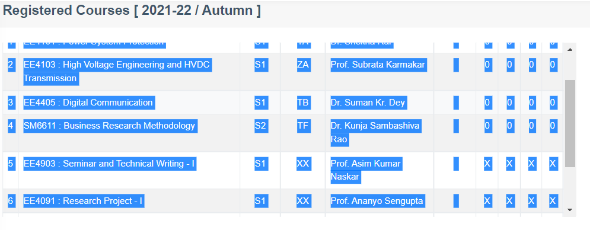
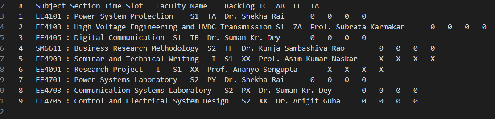
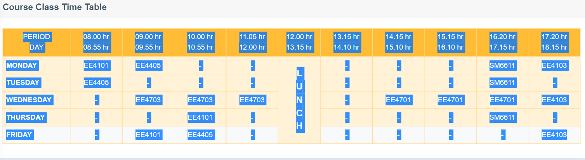
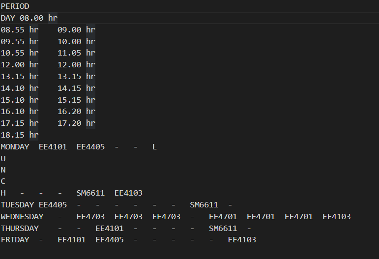
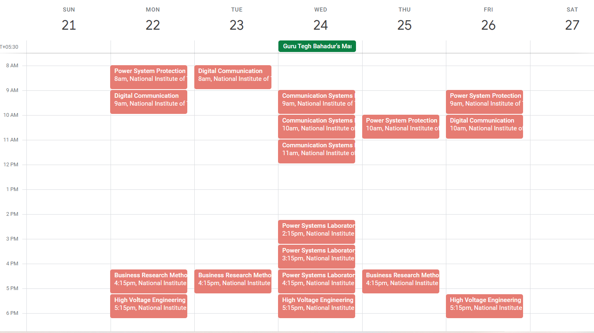
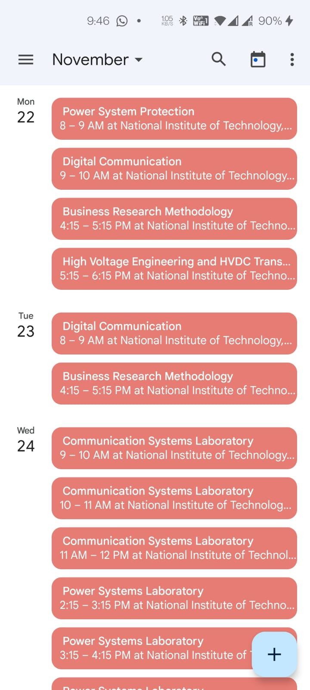

### Follow this simple code to generate a calendar file (Google,Outlook,iCloud Calendar etc) for your personal NITRIS schedule!

The current stage of this project uses a Jupyter Notebook file which should run on any preferred IDE and an updated version of python with the ipykernel.

### Steps to Run:

1. Copy the whole text of registered courses for the first input.
   

    Should look almost like this:
    

2. Copy the whole text of timetable for the second input.
   

    Should look almost like this:
    

3. Run the remaining code, a file 'ClassSchedule.ics' will be created.

4. Simply import the file to any of your Calendar App.

### Results

### Connect with me:

[][website]
[][instagram]
[][linkedin]
[][twitter]

[website]: https://swagatkumar.net/
[twitter]: https://twitter.com/SwagatK24497938
[youtube]: https://youtube.com/codeSTACKr
[instagram]: https://www.instagram.com/swagatkumarflute/
[linkedin]: https://www.linkedin.com/in/swagat-kumar/
